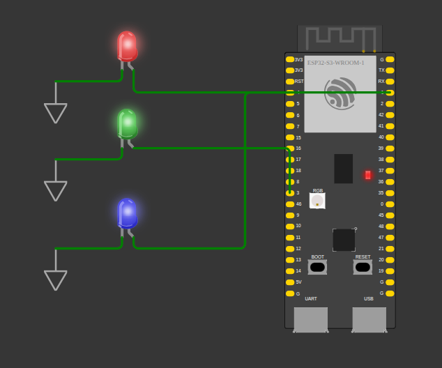

  <h1>ESP32 SNACKS</h1>
  

    <strong>
A collection of small programs wirtten for esp32 mcirocontrollers primarily the esp32-s3
    </strong>
  

<i>Made with</i>

## Blinkers(projects/blinkers)

  

    A simple program to blink the onboard LEDs of the esp32-s3 making use of the basic freertos api

