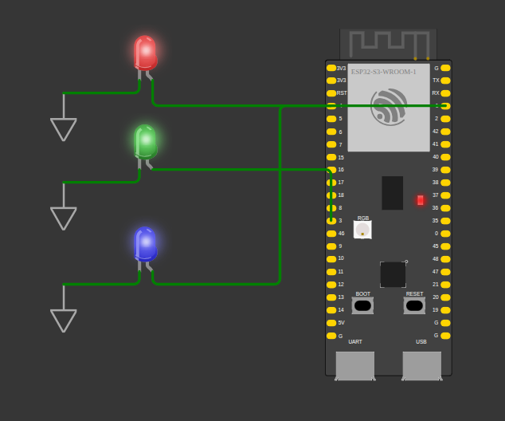
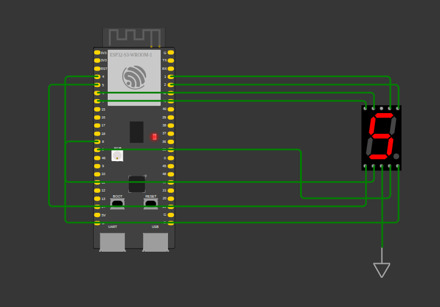
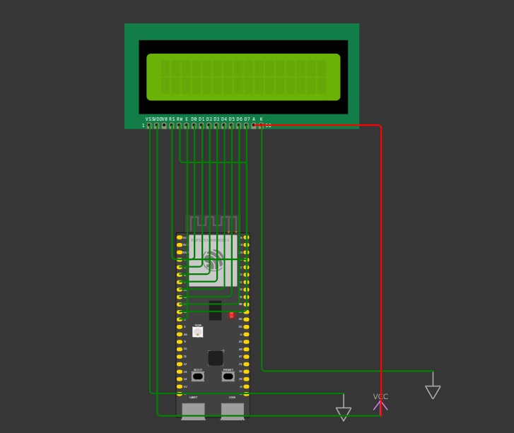

  <h1>ESP32 SNACKS</h1>
  

    <strong>
A collection of small programs wirtten for esp32 mcirocontrollers primarily the esp32-s3
    </strong>
  

<i>Made with</i>

  <h2><a href="projects/blinkers">Blinkers</a></h2>

  
  

    <i>A simple program to blink the onboard LEDs of the esp32-s3 making use of the basic freertos api</i>
  

  <h2><a href="projects/7-seg-disp">7 Segment Display</a></h2>

  
  

    <i>A program displaying numbers 0 through 9 on a seven segment display</i>
  

  <h2><a href="projects/lcd_cursor">LCD Cursor</a></h2>

  
  

    <i>A simple program showing a blinking cursor on an  LCD1602  display</i>
  

